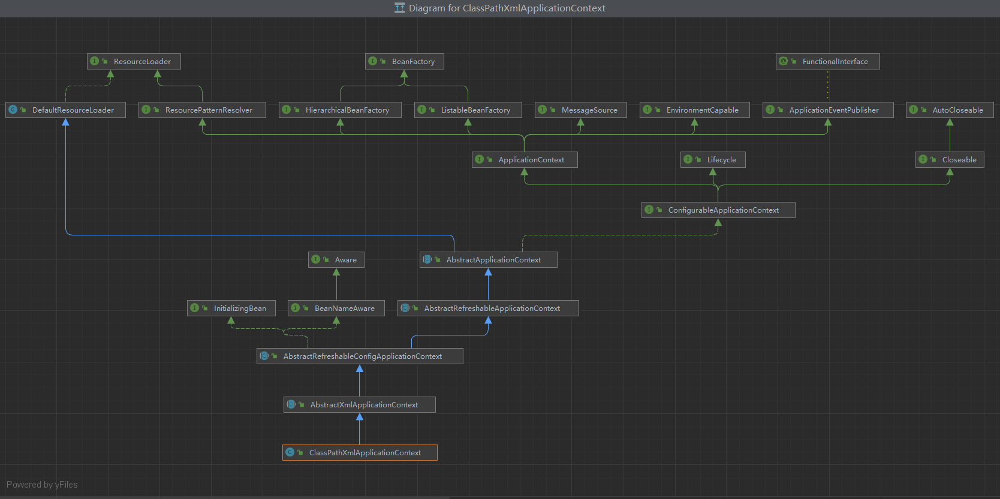
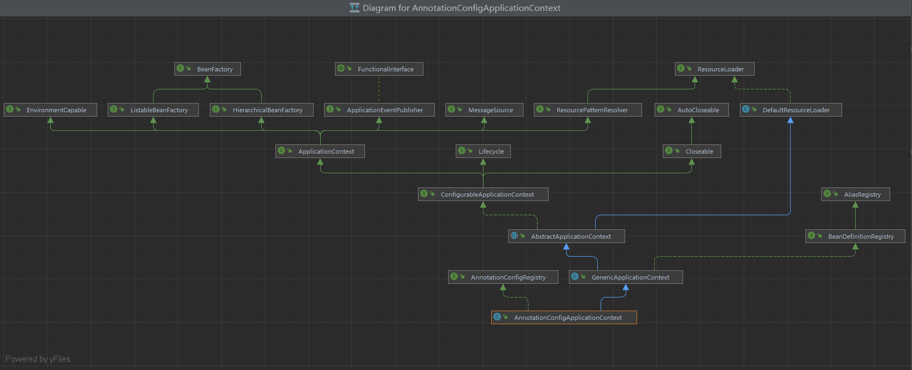
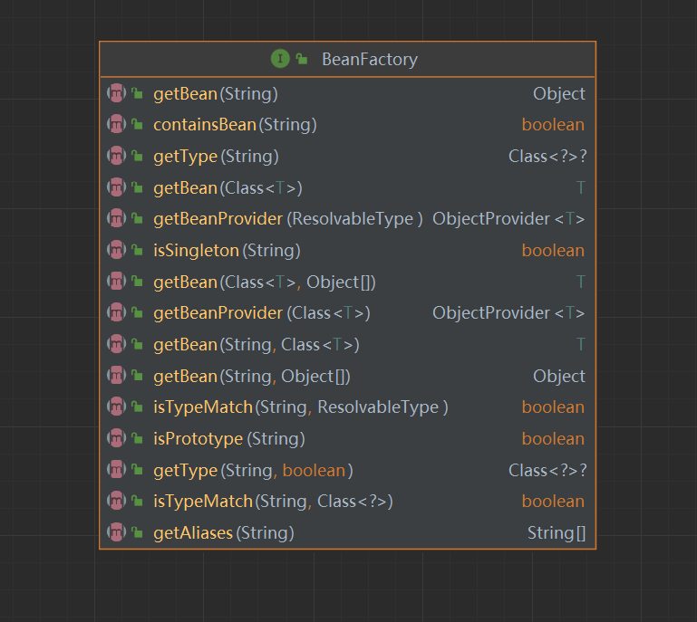

# 读尽天下源码，心中自然无码

:star: 针对最新的5.3.23版本的Spring框架文档
## 主要模块
### Overview 概述

history, design philosophy, feedback, getting started.

发展历史，设计理念，反馈，起步

### Core 核心

IoC Container, Events, Resources, i18n, Validation, Data Binding, Type Conversion, SpEL, AOP.

Ioc 容器，事件，资源，国际化，校验，数据绑定，类型转换，Spring表达式（Spring Expression Language）,切面编程

### Testing 测试
Mock Objects, TestContext Framework, Spring MVC Test, WebTestClient.

### Data Access
Transactions, DAO Support, JDBC, R2DBC, O/R Mapping, XML Marshalling.

### Web Servlet
Spring MVC, WebSocket, SockJS, STOMP Messaging.

### Web Reactive
Spring WebFlux, WebClient, WebSocket, RSocket.

### Integration
Remoting, JMS, JCA, JMX, Email, Tasks, Scheduling, Caching.

### Languages
Kotlin, Groovy, Dynamic Languages.

支持多种其他语言

### Appendix
Spring properties.

### Wiki
What’s New, Upgrade Notes, Supported Versions, and other cross-version information.

## 开始
根据官方文档中

The Spring Framework is divided into modules. Applications can choose which modules they need. At the heart are the modules of the core container, including a configuration model and a dependency injection mechanism.

Spring框架分为多个模块。应用程序可以选择所需的模块。核心是核心容器的模块，包括配置模型和依赖注入机制。

而在Spring框架核心中，IOC控制反转容器最重要。

Foremost amongst these is the Spring Framework’s Inversion of Control (IoC) container. A thorough treatment of the Spring Framework’s IoC container is closely followed by comprehensive coverage of Spring’s Aspect-Oriented Programming (AOP) technologies. 

**The org.springframework.beans and org.springframework.context packages are the basis for Spring Framework’s IoC container.** 
The BeanFactory interface provides an advanced configuration mechanism capable of managing any type of object. ApplicationContext is a sub-interface of BeanFactory. It adds:

- Easier integration with Spring’s AOP features

- Message resource handling (for use in internationalization)

- Event publication

- Application-layer specific contexts such as the WebApplicationContext for use in web applications.

而在org.springframework.beans和org.springframework.context包是Spring框架IoC容器的基础。

## IOC 控制反转
### 体验
:star:体验一下IOC容器控制反转
前提: 把Spring源码clone下来。(也可以使用我仓库的代码调试)
如果编译报错：
无效发行版本：xx,请把JDK升级为17版本

#### ① 方式一：配置文件注入

Config.xml

```xml
<?xml version="1.0" encoding="UTF-8"?>
<beans xmlns="http://www.springframework.org/schema/beans"
	   xmlns:xsi="http://www.w3.org/2001/XMLSchema-instance"
	   xsi:schemaLocation="http://www.springframework.org/schema/beans
        https://www.springframework.org/schema/beans/spring-beans.xsd">
	<bean class="base.SimpleBean"></bean>
</beans>
```

SimpleBean.java

```java
// 需要被控制反转的类
public class SimpleBean {

	public void awkwardSmile(){
		System.out.println("I definitely love coding!");
	}
}
```

Main.java

```java
public class GetStart {

	public static void main(String[] args) {
		byConfigFile();
	}
	public static void byConfigFile() {
		ClassPathXmlApplicationContext context = new ClassPathXmlApplicationContext("config.xml");
		SimpleBean bean = context.getBean(SimpleBean.class);
		bean.awkwardSmile();
		context.close();
	}
}
```


#### ② 方式二：配置文件注入

AnnotationSimpleBean.java

```java
// 需要被控制反转的类
public class AnnotationSimpleBean {

	private String name;

	private String email;

	public AnnotationSimpleBean(String name, String email) {
		this.name = name;
		this.email = email;
	}

	public void introduce(){
		System.out.println(String.format("Here is %s, my email is %s. Welcome to send me an office!",this.name,this.email));
	}

}
```

SimpleBeanConfig.java

```java
@Configuration
public class SimpleBeanConfig {

	@Bean
	public AnnotationSimpleBean annotationBean(){
		return new AnnotationSimpleBean("Xander chow","zhrunxin33@gmail.com");
	}
}
```

执行器入口Main.java

```java
public static void byAnnotationConfig() {
		AnnotationConfigApplicationContext context = new AnnotationConfigApplicationContext(SimpleBeanConfig.class);
		AnnotationSimpleBean bean = context.getBean(AnnotationSimpleBean.class);
		bean.introduce();
		context.close();
	}
```

可以看到我们创建对象的时候，就不需要使用new xx()。绝大多数时候，我们只需要用到单例，这就意味着我们每个类都需要写单例模式。当对象创建销毁交给Spring容器管理，我们就可以不用考虑（默认是单例模式）。


### 继承关系

光标停留在**ClassPathXmlApplicationContext**和**AnnotationConfigApplicationContext**上，使用快捷键Ctrl+Alt+U查看继承图。


**1.ClassPathXmlApplicationContext**




**2.AnnotationConfigApplicationContext**



可知BeanFactory是IOC容器功能的根接口。

我们不要害怕阅读，双击左上角的BeanFactory接口。可以看到这个类定义了哪些行为（接口）



看得到，这里定义了一系列获取Bean实例的方法，并且定义了判断容器是否包含该bean，是否单例或多例模式。

这样，每个接口粗略看看（不用死记的）

- `Beanfactory`: 获取Bean实例的方法，并且定义了判断容器是否包含该bean，是否单例或多例模式.
- `applicationContext`: 应用上下文核心接口， 各类上下文实现类都是它的实现类
